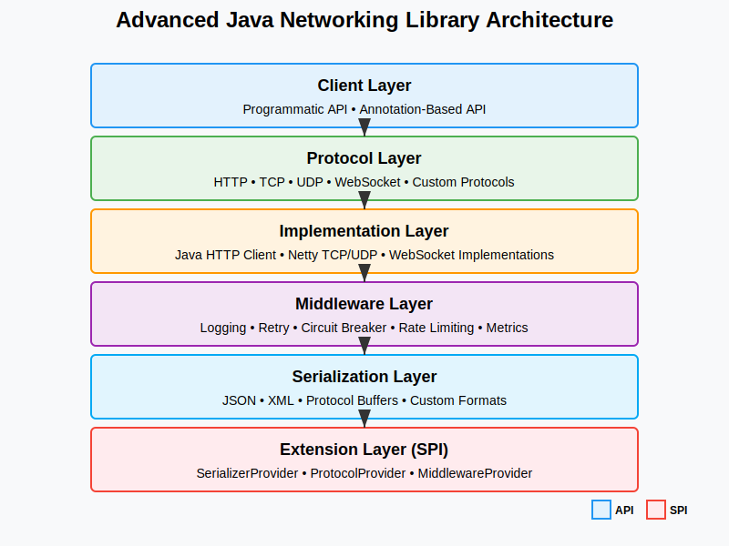
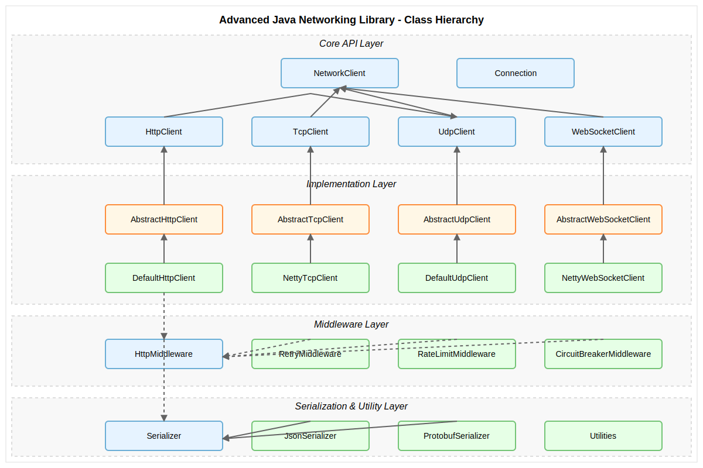

# Advanced Java Networking Library

An enterprise-grade Java networking library providing robust, scalable, and feature-rich networking capabilities with a fluent API design.

## Overview

This library implements modern design patterns and best practices to offer a comprehensive networking solution for Java applications. It supports multiple protocols (HTTP, TCP, UDP, WebSocket) with a consistent API pattern, advanced features like circuit breaking, rate limiting, and extensive monitoring capabilities.

## Features

- **Multi-protocol support**: HTTP, WebSockets, TCP, and UDP
- **Fluent API design**: Intuitive builder patterns for easy configuration
- **Annotation-based clients**: Declarative HTTP client interfaces
- **Resilience patterns**: Circuit breakers, retry mechanisms, timeouts, backoff strategies
- **Async operations**: Non-blocking I/O with CompletableFuture
- **Middleware architecture**: Extensible request/response processing pipeline
- **Advanced monitoring**: Metrics, logging, tracing integration
- **Protocol adapters**: Seamless protocol switching
- **Secure by default**: TLS/SSL integration, robust authentication
- **Efficient resource management**: Connection pooling, keepalives
- **Serialization framework**: Pluggable formats (JSON, Protocol Buffers, etc.)
- **Extensibility**: SPI interfaces for custom protocol and serialization providers

## Design Principles

- SOLID principles
- Composition over inheritance
- Interface-based design
- Immutability where appropriate
- Consistent error handling
- Comprehensive testing

## Implementation Status

| Component | Status | Notes |
|-----------|--------|-------|
| Core Framework | ✅ Complete | Core interfaces, configuration, exceptions |
| TCP Client | ✅ Complete | Full Netty-based implementation |
| HTTP Client Interfaces | ✅ Complete | All interfaces defined |
| HTTP Client Implementation | ✅ Complete | Full implementation with Java HTTP Client |
| Serialization Framework | ✅ Complete | JSON implementation with Jackson |
| Middleware Framework | ✅ Complete | Interfaces and base classes |
| Middleware Implementations | ✅ Complete | Logging, retry, rate limiting, resilience middleware |
| UDP Client | ✅ Complete | Basic implementation available |
| WebSocket Client | ✅ Complete | Basic implementation available |
| Unit Tests | 🔴 Not Started | To be implemented |

## Documentation

Comprehensive documentation is available in the [docs](docs/) directory:

- [Documentation Index](docs/README.md)
- [Architecture Overview](docs/ARCHITECTURE.md)
- [Class Hierarchy](docs/CLASS_HIERARCHY.md)

### Architecture Diagram



This diagram illustrates the layered architecture of the library, showing how the different components interact. The design follows a clean separation of concerns, allowing for flexibility and modularity.

### Class Hierarchy



The class hierarchy diagram shows the inheritance and implementation relationships between the major interfaces and classes in the library. This demonstrates the application of design principles like interface-based design and composition over inheritance.

## Getting Started

Add the library to your Maven project:

```xml
<dependency>
    <groupId>com.network</groupId>
    <artifactId>advanced-networking</artifactId>
    <version>1.0.0</version>
</dependency>
```

## Quick Examples

### HTTP Client Example

```java
// Create a client with default settings
HttpClient client = NetworkLib.createHttpClient()
    .withBaseUrl("https://api.example.com")
    .withTimeout(Duration.ofSeconds(30))
    .withRetry(RetryPolicy.builder()
        .maxAttempts(3)
        .exponentialBackoff(Duration.ofMillis(100))
        .build())
    .build();

// Make a request
HttpResponse<User> response = client.request()
    .path("/users/{id}")
    .pathParam("id", "123")
    .header("Authorization", "Bearer token")
    .get()
    .deserializeAs(User.class)
    .execute();

// Or with async API
CompletableFuture<HttpResponse<User>> future = client.requestAsync()
    .path("/users")
    .post()
    .body(new User("John", "Doe"))
    .deserializeAs(User.class)
    .execute();
```

### Annotation-Based HTTP Client Example

```java
// Define your API interface with annotations
@HttpClient(baseUrl = "https://api.example.com")
@DefaultHeaders({
    @HeaderDef(name = "Accept", value = "application/json"),
    @HeaderDef(name = "User-Agent", value = "AdvancedNetworking/1.0")
})
public interface UserService {
    @GET("/users/{id}")
    @CircuitBreaker(failureThreshold = 3, resetTimeout = 30000)
    User getUserById(@PathVariable("id") String id);
    
    @POST("/users")
    @Retry(maxAttempts = 3, backoff = @Backoff(delay = 1000, multiplier = 2))
    User createUser(@Body User user);
    
    @PUT("/users/{id}")
    User updateUser(@PathVariable("id") String id, @Body User user);
    
    @DELETE("/users/{id}")
    void deleteUser(@PathVariable("id") String id, @RequestParam("authToken") String token);
}

// Create an implementation of the interface
UserService userService = NetworkLib.createClient(UserService.class);

// Use the client
User user = userService.getUserById("123");
User newUser = userService.createUser(new User("John Doe", "john@example.com"));
userService.deleteUser("123", "auth-token-123");
```

### TCP Socket Example

```java
// Create a TCP client
TcpClient client = NetworkLib.createTcpClient()
    .withAddress("example.com", 9000)
    .withConnectionTimeout(Duration.ofSeconds(5))
    .withKeepAlive(true)
    .build();

// Send data and receive response
byte[] response = client.send(data)
    .expectReply()
    .withTimeout(Duration.ofSeconds(10))
    .execute();

// Register event handlers
client.onConnect(conn -> logger.info("Connected to server"))
    .onDisconnect(reason -> logger.warn("Disconnected: {}", reason))
    .onError(ex -> logger.error("Error occurred", ex));
```

### UDP Client Example

```java
// Create a UDP client
UdpClient client = NetworkLib.createUdpClient()
    .withAddress("example.com", 9000)
    .withTimeout(Duration.ofSeconds(5))
    .build();

// Send data (fire and forget)
client.send(data).execute();

## Contributing

Please see [CONTRIBUTING.md](CONTRIBUTING.md) for details on our code of conduct and the process for submitting pull requests.